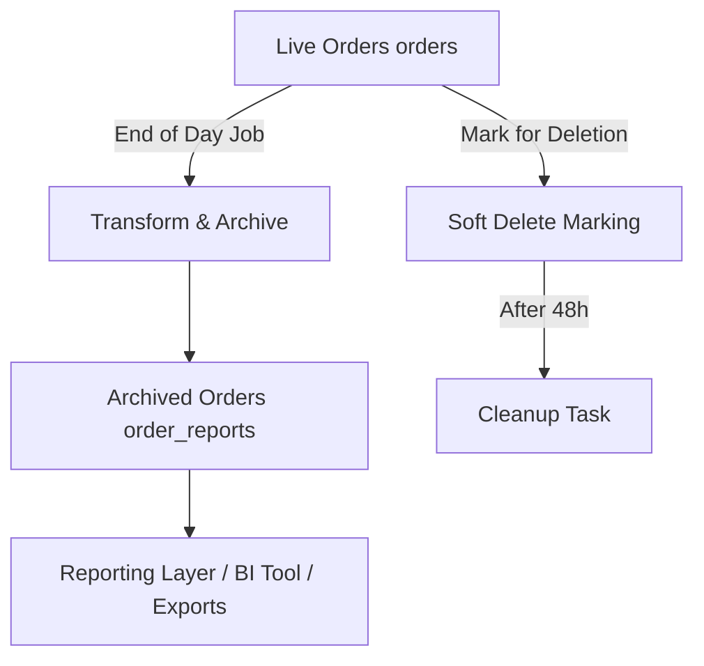

## MongoDB Orders Collection Pruning

### Goals

- Prevent performance degradation in the primary `orders` collection due to size.
- Separate read-heavy reporting workloads from write-heavy operational data.
- Enable simpler, faster analytics on denormalized structures.

---

### Key Concepts

#### 🔄 Live `orders` Collection

- **Collection Name:** `orders`
- **Behavior:** Write-heavy. Receives live traffic from Order App.
- **Lifecycle:** Data is only kept here temporarily (e.g., 1 day max).
- **Index Strategy:** Tuned for order acceptance, kitchen routing, and basic order status queries.

#### 🗃 Archived `order_reports` Collection

- **Collection Name:** `order_reports`
- **Behavior:** Read-heavy. Used for reports, dashboards, analysis.
- **Lifecycle:** Append-only. Immutable after archival.
- **Denormalization:**
  - Flatten `menuItem` references into full objects
  - Include computed totals
  - Include resolved `stationNames`, `originType`, etc.

> 🧾 Note: This will use a **flat structure** (not grouped by restaurantId).

---

### Pruning Architecture

---

### Step-by-Step Flow

#### 1. **End of Day Trigger (Per Restaurant)**

- Triggered once per restaurant after their daily operations close
- Configurable via timezone-aware setting in restaurant document
- Query: `createdAt < endOfDay(restaurantTZ)`

#### 2. **Export + Transform**

- For each order:
  - Embed resolved `menuItems`, `modifiers`, `prices`, `stations`
  - Compute `totalCents`, `taxCents`, `discounts`
  - Attach `restaurantName`, `locationName`, `brand`
- Write to `order_reports` collection

#### 3. **Mark for Deletion**

- Add a field: `markedForDeletionAt = <timestamp>`
- Used for soft deletion logic and safety window

#### 4. **Delayed Hard Delete (48h Later)**

- Scheduled job checks for `markedForDeletionAt < now - 48h`
- Permanently deletes entries from `orders`

---

### Backup Considerations

- We rely on **MongoDB Atlas daily backups** (full snapshot)
- This ensures:
  - Safety against accidental deletion or corruption
  - Point-in-time recovery across environments
  - Optional export to Azure Blob Storage if long-term cold storage is needed
- No need for ad-hoc backups before archival deletion due to retention window and robust backup policy

---

### Implementation Notes

- Use `$merge` in aggregation pipelines if feasible
- Consider using `change streams` for near-real-time sync later
- Pruning task must be **idempotent**
- Allow dry-run mode for manual verification
- Add metadata like `archivedAt`, `archivedBy`

---

### Deferred: Summary Tables for Fast Reporting

- Will revisit once the analytics/reporting module is being planned.
