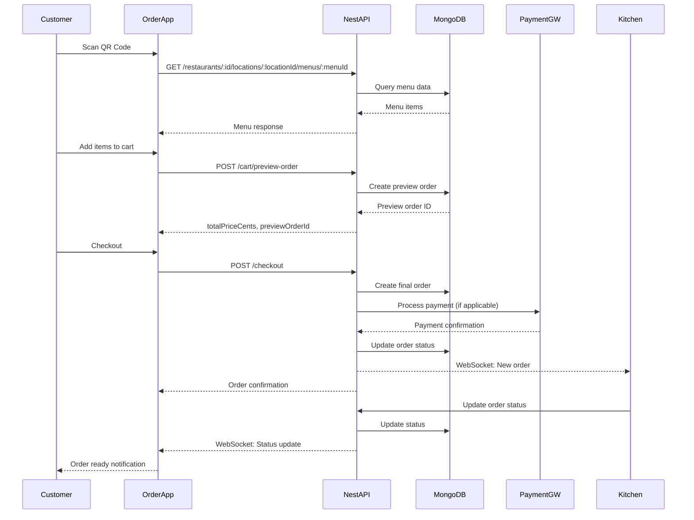
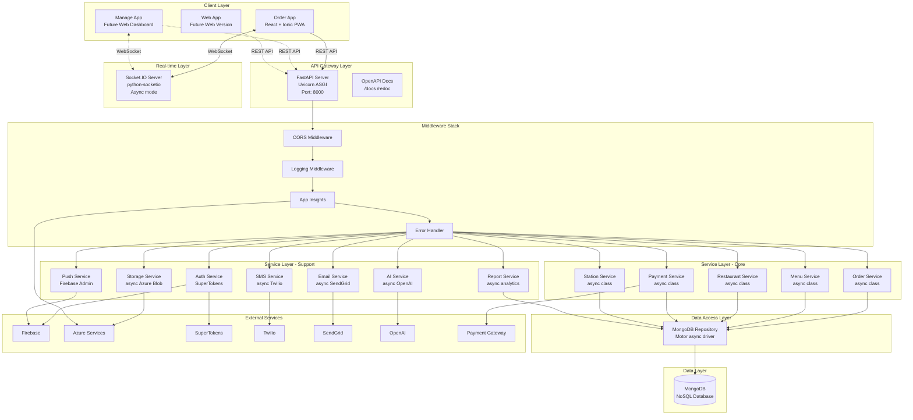

# OrderBuddy Backend Migration Assessment
## NestJS to Python Technical Analysis

---

## Executive Summary

This document provides a comprehensive analysis of the OrderBuddy backend system, evaluates the feasibility of migrating from NestJS (TypeScript) to Python, and provides architecture recommendations for the migration.

**Key Findings:**
- Current NestJS backend is feature-rich with 15+ modules
- Python migration is **HIGHLY FEASIBLE** with appropriate framework selection
- Recommended approach: **FastAPI** or **Django REST Framework** for the Python backend
- Migration can support both mobile clients and future web version effectively

---

## 1. Current Architecture (NestJS Backend)

### 1.1 System Overview

OrderBuddy is an AI-native restaurant ordering system with:
- **Customer Order App** (React + Ionic PWA)
- **Manage App** (Restaurant dashboard - planned)
- **Backend API** (NestJS with TypeScript)
- **Database** (MongoDB)
- **Cloud Services** (Azure, Firebase)

### 1.2 Current Technology Stack

**Backend (NestJS):**
- Node.js v22+ with NestJS 11.x
- TypeScript 5.x
- MongoDB with nest-mongodb-driver
- Express.js as HTTP server
- WebSocket support via Socket.IO

**Key Dependencies:**
- Authentication: SuperTokens
- Monitoring: Azure Application Insights
- Storage: Azure Blob Storage
- Email: SendGrid
- SMS: Twilio
- Push Notifications: Firebase Admin SDK, Web Push
- AI: OpenAI SDK
- Payment: EmergePay SDK
- Real-time: Socket.IO
- API Documentation: Swagger/OpenAPI

**Frontend (Customer Order App):**
- React 19 + Ionic 8
- TanStack React Query for data fetching
- Zustand for state management
- Axios for HTTP requests
- Capacitor for mobile deployment

### 1.3 Current Architecture Diagram

```mermaid
graph TB
    subgraph "Client Layer"
        OrderApp[Order App<br/>React + Ionic PWA]
        ManageApp[Manage App<br/>Future Web Dashboard]
    end

    subgraph "API Gateway Layer"
        NestAPI[NestJS API Server<br/>Port: 3000]
        Swagger[Swagger Docs<br/>/swagger]
    end

    subgraph "Service Layer"
        OrderAppSvc[Order App Service<br/>Customer Ordering]
        MenuSvc[Menu Service<br/>Menu Management]
        RestSvc[Restaurant Service<br/>Restaurant Info]
        PaySvc[Payment Service<br/>EmergePay]
        StationSvc[Station Service<br/>Kitchen Routing]
        AuthSvc[Auth Service<br/>SuperTokens]
        EmailSvc[Email Service<br/>SendGrid]
        SmsSvc[Message Service<br/>Twilio]
        WebPushSvc[Web Push Service<br/>Notifications]
        StorageSvc[Storage Service<br/>Azure Blob]
        AISvc[AI Service<br/>OpenAI]
        ReportSvc[Report Service<br/>Analytics]
        PosSvc[POS Service<br/>Integration]
    end

    subgraph "Real-time Layer"
        WSGateway[WebSocket Gateway<br/>Socket.IO<br/>Events Service]
    end

    subgraph "Data Layer"
        MongoDB[(MongoDB)]
    end

    subgraph "External Services"
        Firebase[Firebase<br/>Auth & Push]
        Azure[Azure Services<br/>Blob + Insights]
        SuperTokens[SuperTokens<br/>Auth Service]
        Twilio[Twilio SMS]
        SendGrid[SendGrid Email]
        OpenAI[OpenAI API]
        EmergePay[EmergePay<br/>Payment Gateway]
    end

    OrderApp -->|REST API| NestAPI
    ManageApp -.->|Future| NestAPI

    NestAPI --> OrderAppSvc
    NestAPI --> MenuSvc
    NestAPI --> RestSvc
    NestAPI --> PaySvc
    NestAPI --> StationSvc
    NestAPI --> AuthSvc
    NestAPI --> EmailSvc
    NestAPI --> SmsSvc
    NestAPI --> WebPushSvc
    NestAPI --> StorageSvc
    NestAPI --> AISvc
    NestAPI --> ReportSvc
    NestAPI --> PosSvc

    OrderApp <-->|WebSocket| WSGateway
    ManageApp <-.->|WebSocket| WSGateway

    OrderAppSvc --> MongoDB
    MenuSvc --> MongoDB
    RestSvc --> MongoDB
    PaySvc --> MongoDB
    StationSvc --> MongoDB
    ReportSvc --> MongoDB
    PosSvc --> MongoDB

    AuthSvc --> SuperTokens
    AuthSvc --> Firebase
    StorageSvc --> Azure
    EmailSvc --> SendGrid
    SmsSvc --> Twilio
    WebPushSvc --> Firebase
    AISvc --> OpenAI
    PaySvc --> EmergePay

    NestAPI --> Azure
```



### 1.4 Current Module Structure

```
src/api/src/
├── main.ts                 # Application bootstrap
├── app.module.ts           # Root module
├── auth/                   # Authentication (SuperTokens)
├── order-app/              # Customer order endpoints
├── menu/                   # Menu management
├── restaurant/             # Restaurant management
├── payments/               # Payment processing
├── stations/               # Kitchen routing
├── origins/                # QR code origins
├── location-settings/      # Location configuration
├── printers/               # Printer integration
├── pos/                    # POS integration
├── report/                 # Analytics & reporting
├── email/                  # Email service
├── message/                # SMS service
├── web-push/               # Push notifications
├── storage/                # Azure blob storage
├── ai/                     # AI integration
├── campaign/               # Marketing campaigns
├── events/                 # WebSocket events
├── users/                  # User management
├── db/
│   ├── models/            # Database models
│   └── collections.ts     # Collection names
├── config/                # Configuration
├── logger/                # Logging (Pino)
└── middleware/            # Middleware (logging, insights)
```

### 1.5 Key API Endpoints Analysis

**Order App Endpoints (Customer):**
```
GET    /order-app/restaurants/:restaurantId
GET    /order-app/restaurants/:restaurantId/locations/:locationId
GET    /order-app/restaurants/origins/:originId
GET    /order-app/restaurants/:restaurantId/locations/:locationId/menus
GET    /order-app/restaurants/:restaurantId/locations/:locationId/menus/:menuId
POST   /order-app/cart/preview-order
POST   /order-app/checkout
GET    /order-app/orders/:orderId/status
```

**Menu App Endpoints:**
```
GET    /menu-app/:restaurantId
GET    /menu-app/order/:orderId
POST   /menu-app/restaurant/order
```

**Payment Endpoints:**
```
POST   /payments/place-order-without-payment
POST   /payments/*
```

**WebSocket Events:**
```
order:status:updated
kitchen:order:new
station:update
```

### 1.6 Database Collections

```
- restaurants
- locations
- menus
- origins
- stations
- orders
- orders_preview
- users
- subscriptions
- campaigns
```

### 1.7 Current Data Flow



---

## 2. Migration Feasibility Analysis

### 2.1 Python Framework Comparison

| Feature | FastAPI | Django REST Framework | Flask + Extensions |
|---------|---------|----------------------|-------------------|
| **Performance** | Excellent (async) | Good | Good |
| **Type Safety** | Excellent (Pydantic) | Good | Limited |
| **Async Support** | Native | Limited | Supported |
| **API Documentation** | Auto (OpenAPI) | Good (drf-spectacular) | Manual |
| **WebSocket** | Native | Channels required | SocketIO supported |
| **Learning Curve** | Low | Medium | Low |
| **Production Ready** | Yes | Yes | Yes |
| **Community** | Growing | Mature | Mature |
| **Migration Ease** | **Excellent** | Good | Fair |

**Recommendation: FastAPI** is the best choice for this migration due to:
1. Native async support (matches NestJS async patterns)
2. Automatic OpenAPI documentation (like Swagger in NestJS)
3. Pydantic validation (similar to class-validator in NestJS)
4. Native WebSocket support
5. High performance
6. Modern Python type hints

### 2.2 Feature Mapping: NestJS → Python (FastAPI)

| NestJS Feature | Python Equivalent | Library/Approach |
|----------------|-------------------|------------------|
| **Modules** | Routers/Blueprints | FastAPI APIRouter |
| **Controllers** | Route Handlers | @app.get, @app.post decorators |
| **Services** | Service Classes | Python classes with dependency injection |
| **DTOs** | Pydantic Models | pydantic.BaseModel |
| **Validation** | Pydantic Validation | Built-in to FastAPI |
| **Dependency Injection** | FastAPI Dependencies | Depends() |
| **Middleware** | ASGI Middleware | Starlette middleware |
| **Guards** | Dependencies | FastAPI Depends() |
| **Interceptors** | Middleware | Custom middleware |
| **WebSockets** | WebSocket Routes | FastAPI WebSocket |
| **Swagger** | OpenAPI | Auto-generated by FastAPI |
| **Configuration** | Environment Config | pydantic-settings |
| **Logging** | Python Logging | loguru or structlog |

### 2.3 External Service Integration Assessment

| Service | Current (NestJS) | Python Support | Python Library | Migration Difficulty |
|---------|-----------------|----------------|----------------|---------------------|
| **MongoDB** | nest-mongodb-driver | Excellent | motor (async) or pymongo | Easy |
| **SuperTokens** | supertokens-node | Excellent | supertokens-python | Easy |
| **Azure Blob Storage** | @azure/storage-blob | Excellent | azure-storage-blob | Easy |
| **Azure App Insights** | applicationinsights | Excellent | opencensus-ext-azure | Easy |
| **Firebase Admin** | firebase-admin | Excellent | firebase-admin | Easy |
| **SendGrid** | @sendgrid/mail | Excellent | sendgrid | Easy |
| **Twilio** | twilio | Excellent | twilio | Easy |
| **OpenAI** | openai | Excellent | openai | Easy |
| **Socket.IO** | socket.io | Good | python-socketio | Medium |
| **EmergePay SDK** | emergepay-sdk | Unknown | Custom integration | Medium-Hard |
| **Web Push** | web-push | Good | pywebpush | Medium |

**Overall Integration Assessment: HIGHLY FEASIBLE**
- 90% of integrations have excellent Python support
- Only EmergePay may require custom implementation

### 2.4 Migration Complexity Assessment

**Low Complexity (Easy to Migrate):**
- Basic CRUD operations
- Database queries (MongoDB)
- Authentication (SuperTokens has Python SDK)
- Email/SMS services
- Cloud storage
- Configuration management

**Medium Complexity (Moderate Effort):**
- WebSocket implementation (different patterns)
- Real-time event broadcasting
- Middleware and request processing
- Payment integration (if custom)

**High Complexity (Requires Design Changes):**
- None identified (all features are well-supported in Python)

**Overall Migration Complexity: MEDIUM**
- Estimated effort: 4-6 weeks for full migration
- Can be done incrementally with API gateway pattern

---

## 3. Proposed Python Architecture

### 3.1 Recommended Technology Stack

**Backend Framework:**
- **FastAPI** 0.110+ (primary framework)
- **Uvicorn** (ASGI server)
- **Python** 3.11+

**Core Libraries:**
- **pydantic** 2.x - Data validation and settings
- **motor** - Async MongoDB driver
- **python-jose[cryptography]** - JWT handling
- **passlib** - Password hashing
- **python-multipart** - Form data handling

**External Integrations:**
- **supertokens-python** - Authentication
- **azure-storage-blob** - Blob storage
- **opencensus-ext-azure** - Application Insights
- **firebase-admin** - Firebase services
- **sendgrid** - Email service
- **twilio** - SMS service
- **openai** - AI integration
- **python-socketio** - WebSocket support

**Development Tools:**
- **pytest** - Testing framework
- **black** - Code formatting
- **ruff** - Linting
- **mypy** - Static type checking
- **alembic** - Database migrations (if needed)

### 3.2 Proposed Architecture Diagram



### 3.3 Proposed Project Structure

```
orderbuddy-python/
├── app/
│   ├── __init__.py
│   ├── main.py                 # FastAPI application
│   ├── config.py               # Configuration (pydantic-settings)
│   ├── dependencies.py         # Dependency injection
│   │
│   ├── api/
│   │   ├── __init__.py
│   │   ├── v1/
│   │   │   ├── __init__.py
│   │   │   ├── routers/
│   │   │   │   ├── __init__.py
│   │   │   │   ├── order_app.py      # Customer order endpoints
│   │   │   │   ├── menu.py           # Menu endpoints
│   │   │   │   ├── restaurant.py     # Restaurant endpoints
│   │   │   │   ├── payment.py        # Payment endpoints
│   │   │   │   ├── station.py        # Station endpoints
│   │   │   │   ├── auth.py           # Auth endpoints
│   │   │   │   └── ...
│   │   │   └── websocket.py          # WebSocket handlers
│   │
│   ├── models/
│   │   ├── __init__.py
│   │   ├── domain/               # Domain models (MongoDB documents)
│   │   │   ├── __init__.py
│   │   │   ├── order.py
│   │   │   ├── menu.py
│   │   │   ├── restaurant.py
│   │   │   └── ...
│   │   └── schemas/              # Pydantic schemas (DTOs)
│   │       ├── __init__.py
│   │       ├── order.py
│   │       ├── menu.py
│   │       └── ...
│   │
│   ├── services/
│   │   ├── __init__.py
│   │   ├── order_service.py
│   │   ├── menu_service.py
│   │   ├── restaurant_service.py
│   │   ├── payment_service.py
│   │   ├── auth_service.py
│   │   ├── email_service.py
│   │   ├── sms_service.py
│   │   ├── push_service.py
│   │   ├── storage_service.py
│   │   ├── ai_service.py
│   │   └── ...
│   │
│   ├── repositories/
│   │   ├── __init__.py
│   │   ├── base.py               # Base repository
│   │   ├── order_repository.py
│   │   ├── menu_repository.py
│   │   └── ...
│   │
│   ├── core/
│   │   ├── __init__.py
│   │   ├── database.py           # MongoDB connection
│   │   ├── security.py           # Auth utilities
│   │   ├── logging.py            # Logging config
│   │   └── exceptions.py         # Custom exceptions
│   │
│   ├── middleware/
│   │   ├── __init__.py
│   │   ├── logging.py
│   │   ├── error_handler.py
│   │   └── app_insights.py
│   │
│   └── integrations/
│       ├── __init__.py
│       ├── supertokens.py
│       ├── azure_blob.py
│       ├── azure_insights.py
│       ├── firebase.py
│       ├── sendgrid.py
│       ├── twilio.py
│       ├── openai.py
│       └── payment_gateway.py
│
├── tests/
│   ├── __init__.py
│   ├── unit/
│   ├── integration/
│   └── e2e/
│
├── alembic/                      # Database migrations (if needed)
│   └── versions/
│
├── requirements/
│   ├── base.txt
│   ├── dev.txt
│   └── prod.txt
│
├── .env.example
├── .env
├── docker-compose.yml
├── Dockerfile
├── pyproject.toml
├── pytest.ini
└── README.md
```

### 3.4 Sample FastAPI Implementation

**main.py - Application Bootstrap:**
```python
from fastapi import FastAPI
from fastapi.middleware.cors import CORSMiddleware
from app.core.database import connect_to_mongo, close_mongo_connection
from app.core.logging import setup_logging
from app.middleware.app_insights import AppInsightsMiddleware
from app.api.v1.routers import order_app, menu, restaurant, payment
from app.config import settings

app = FastAPI(
    title="OrderBuddy API",
    description="REST API for Order and Manage apps",
    version="2.0.0",
    docs_url="/docs",
    redoc_url="/redoc"
)

# Setup logging
setup_logging()

# CORS middleware
app.add_middleware(
    CORSMiddleware,
    allow_origins=settings.ALLOWED_ORIGINS,
    allow_credentials=True,
    allow_methods=["*"],
    allow_headers=["*"],
)

# Application Insights middleware
app.add_middleware(AppInsightsMiddleware)

# Include routers
app.include_router(order_app.router, prefix="/api/v1/order-app", tags=["Order App"])
app.include_router(menu.router, prefix="/api/v1/menu-app", tags=["Menu"])
app.include_router(restaurant.router, prefix="/api/v1/restaurants", tags=["Restaurant"])
app.include_router(payment.router, prefix="/api/v1/payments", tags=["Payment"])

# Startup event
@app.on_event("startup")
async def startup_event():
    await connect_to_mongo()

# Shutdown event
@app.on_event("shutdown")
async def shutdown_event():
    await close_mongo_connection()

@app.get("/")
async def root():
    return {"message": "OrderBuddy API v2.0 - Python Edition"}
```

---

## 4. Migration Strategy

### 4.1 Recommended Approach: Incremental Migration

```mermaid
graph LR
    subgraph "Phase 1: Setup"
        A1[Setup Python environment]
        A2[Configure FastAPI project]
        A3[Setup MongoDB connection]
        A4[Configure monitoring]
    end

    subgraph "Phase 2: Core Migration"
        B1[Migrate data models]
        B2[Migrate menu endpoints]
        B3[Migrate order endpoints]
        B4[Migrate auth]
    end

    subgraph "Phase 3: Advanced Features"
        C1[Migrate WebSocket]
        C2[Migrate payments]
        C3[Migrate external integrations]
        C4[Migrate reporting]
    end

    subgraph "Phase 4: Testing & Deploy"
        D1[Integration testing]
        D2[Load testing]
        D3[Parallel deployment]
        D4[Full cutover]
    end

    A1 --> A2 --> A3 --> A4
    A4 --> B1 --> B2 --> B3 --> B4
    B4 --> C1 --> C2 --> C3 --> C4
    C4 --> D1 --> D2 --> D3 --> D4
```



### 4.2 Migration Timeline

| Phase | Duration | Deliverables |
|-------|----------|-------------|
| **Phase 1: Setup** | 1 week | Python project structure, DB connection, monitoring |
| **Phase 2: Core** | 2 weeks | Menu, Order, Restaurant endpoints, Auth |
| **Phase 3: Advanced** | 2 weeks | WebSocket, Payments, Integrations |
| **Phase 4: Testing** | 1 week | Tests, deployment, cutover |
| **Total** | **6 weeks** | Full Python backend |

### 4.3 Risk Mitigation

**Technical Risks:**
- WebSocket implementation differences → Use python-socketio with async mode
- Payment SDK compatibility → Implement wrapper with same interface
- Performance differences → Use async everywhere, optimize queries

**Operational Risks:**
- Downtime during migration → Use API gateway for gradual cutover
- Data consistency → Share same MongoDB instance
- Team knowledge → Provide Python/FastAPI training

---

## 5. Benefits of Python Migration

### 5.1 Technical Benefits

1. **Better AI/ML Integration**
   - Native Python ecosystem for AI/ML
   - Better OpenAI SDK support
   - Easy integration with data science tools

2. **Simpler Deployment**
   - Single binary with Docker
   - Lower memory footprint than Node.js
   - Better container optimization

3. **Performance**
   - FastAPI is comparable to NestJS
   - Async support with native asyncio
   - Better CPU-bound task handling

4. **Type Safety**
   - Pydantic provides runtime validation
   - Type hints throughout codebase
   - Better IDE support

5. **Developer Experience**
   - Cleaner, more readable code
   - Larger talent pool
   - Extensive library ecosystem

### 5.2 Business Benefits

1. **Cost Reduction**
   - Lower infrastructure costs (better resource usage)
   - Larger pool of Python developers (hiring)
   - Better long-term maintainability

2. **Scalability**
   - Better support for data processing
   - Easier microservices architecture
   - Better integration with analytics tools

3. **Future-Proofing**
   - Python is industry standard for AI/ML
   - Better suited for AI-native features
   - Strong community and ecosystem

---

## 6. Conclusion

### 6.1 Migration Recommendation: **PROCEED**

**Overall Assessment: HIGHLY FEASIBLE**

The migration from NestJS to Python (FastAPI) is not only feasible but **recommended** for the following reasons:

1. All current features can be replicated in Python
2. External integrations have excellent Python support
3. FastAPI provides similar developer experience to NestJS
4. Better alignment with AI-native vision
5. Can support mobile clients and future web version effectively

### 6.2 Key Success Factors

1. Use **FastAPI** as the primary framework
2. Maintain async patterns throughout
3. Implement comprehensive testing
4. Use incremental migration approach
5. Maintain API contract compatibility

### 6.3 Next Steps

1. Approve migration plan and timeline
2. Setup development environment
3. Create sample endpoints (demo)
4. Begin Phase 1 migration
5. Continuous testing and validation

---

**Document Version:** 1.0
**Date:** January 25, 2026
**Status:** For Review
