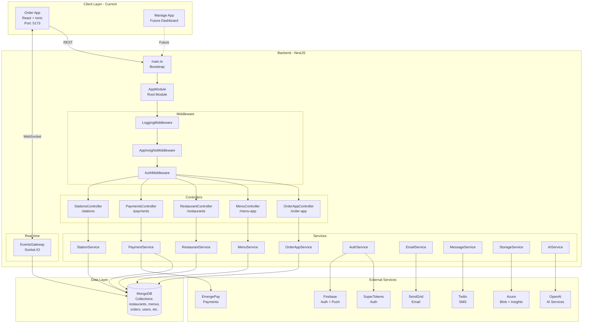
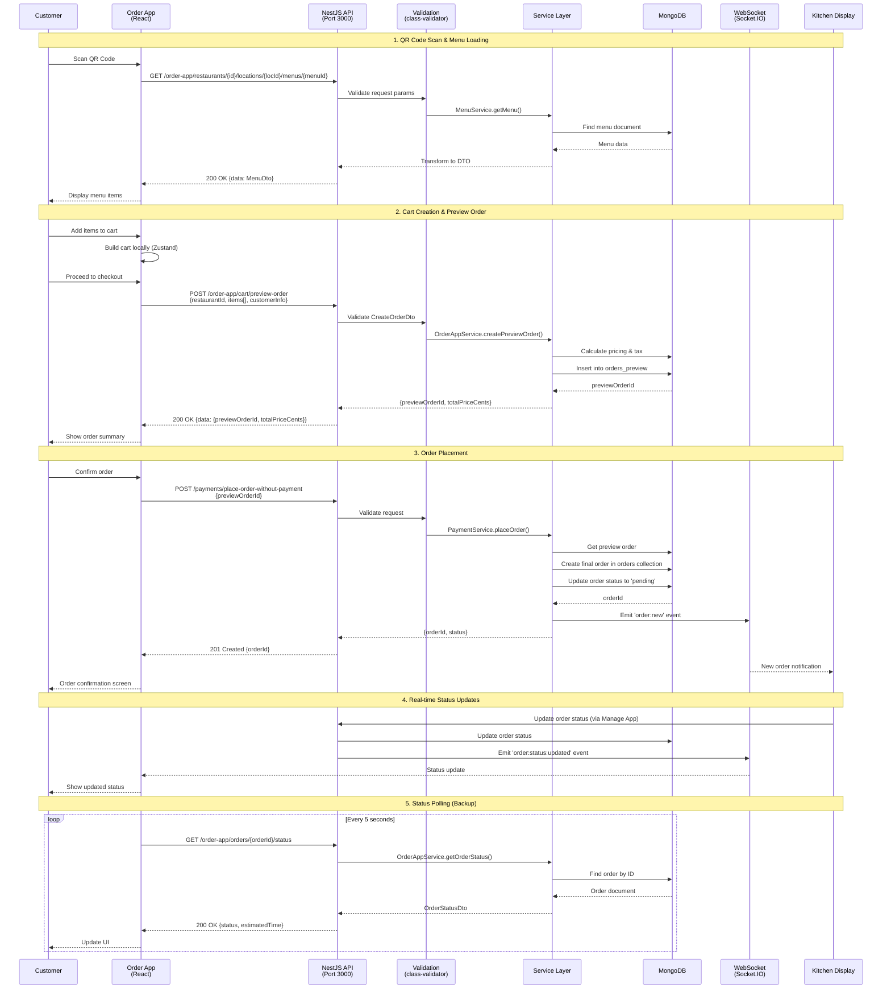
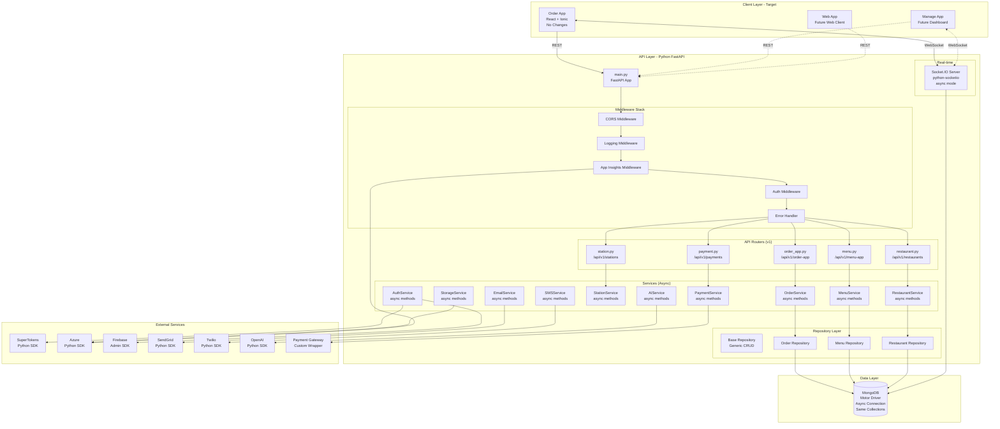
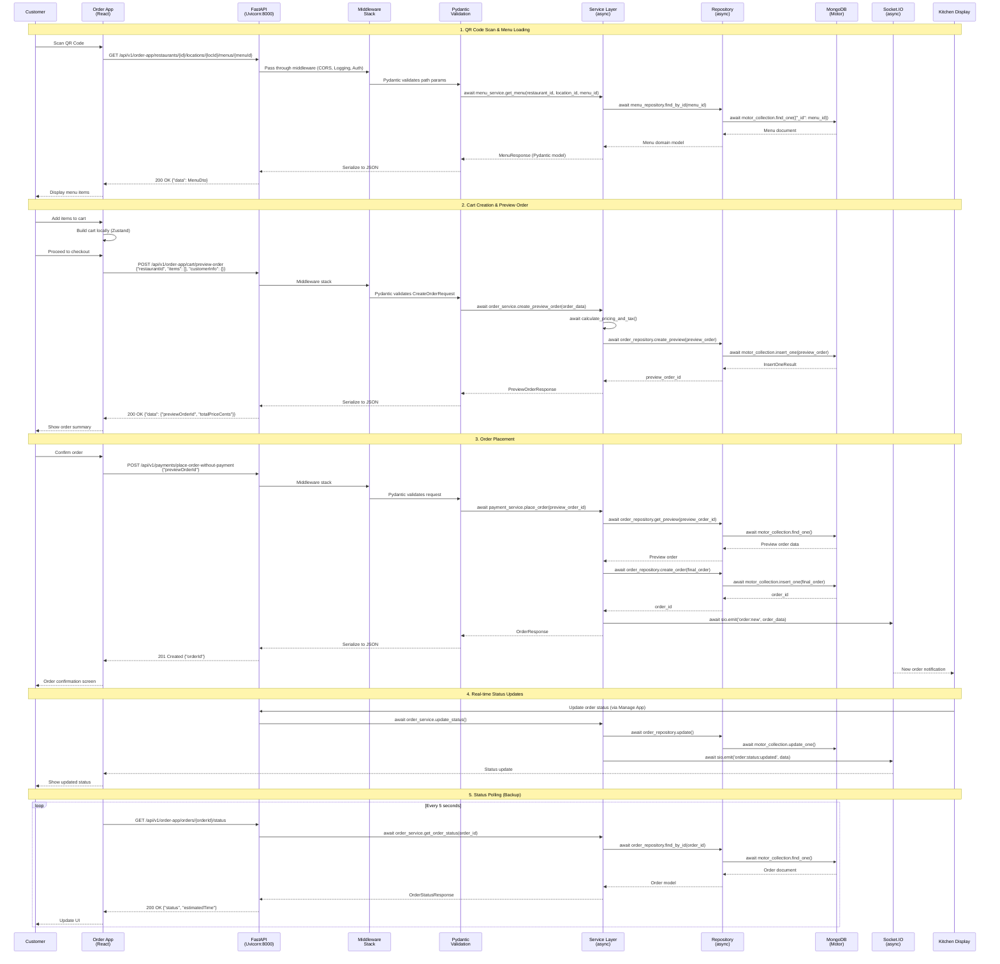
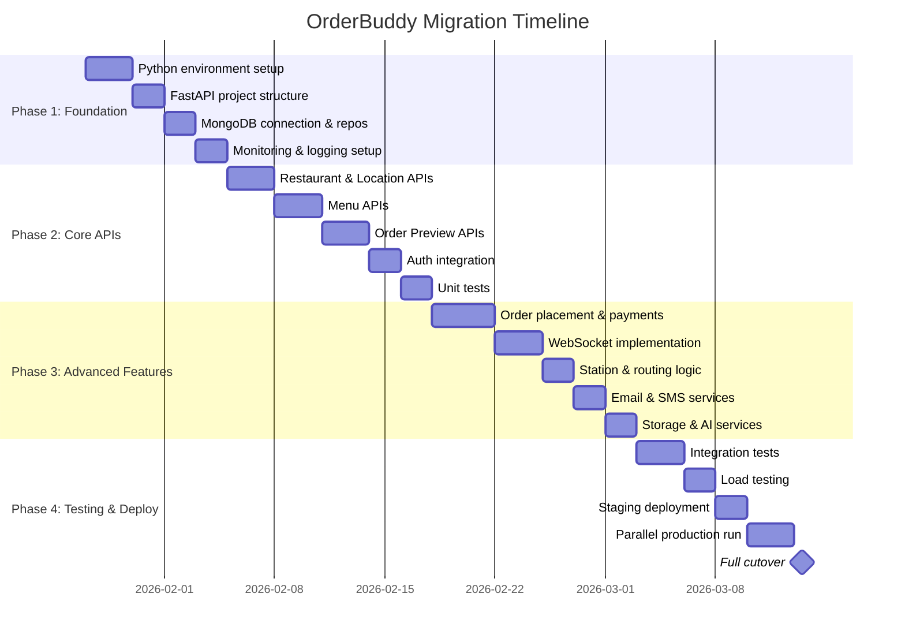
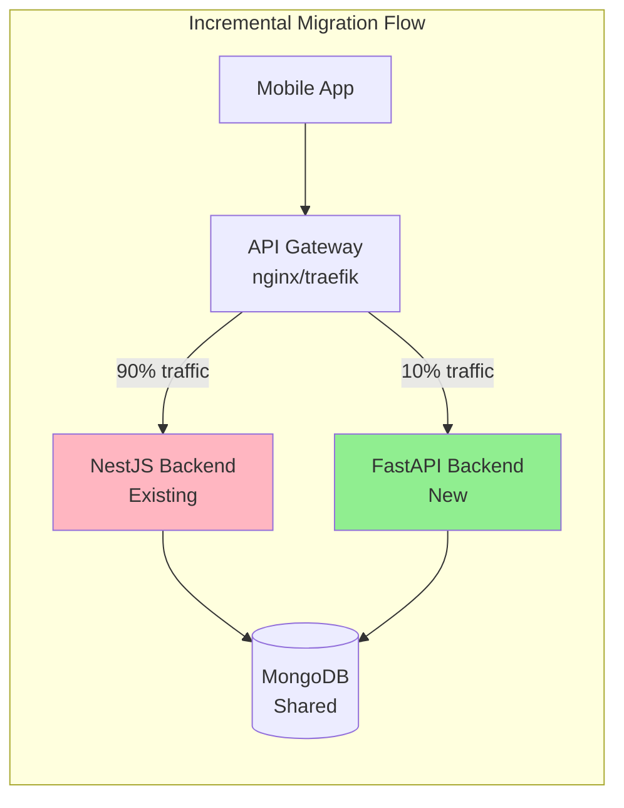
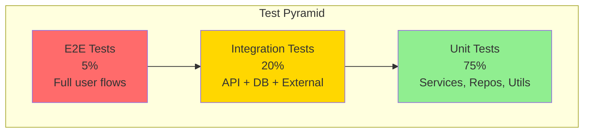
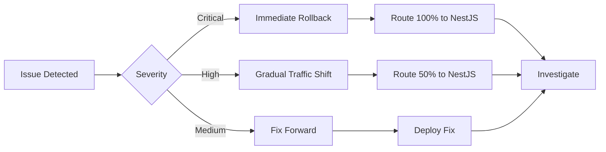

# OrderBuddy Backend Migration Guide
## Complete NestJS to Python FastAPI Migration Strategy

---

## Table of Contents

1. [Executive Summary](#1-executive-summary)
2. [Current State Analysis](#2-current-state-analysis)
3. [Target State Architecture](#3-target-state-architecture)
4. [Detailed Workflow Comparisons](#4-detailed-workflow-comparisons)
5. [Request Flow Analysis](#5-request-flow-analysis)
6. [Component Mapping](#6-component-mapping)
7. [Migration Strategy](#7-migration-strategy)
8. [Technical Implementation Plan](#8-technical-implementation-plan)
9. [Testing Strategy](#9-testing-strategy)
10. [Deployment Strategy](#10-deployment-strategy)
11. [Rollback Plan](#11-rollback-plan)

---

## 1. Executive Summary

### 1.1 Migration Overview

**Current State:** NestJS (TypeScript) backend serving mobile PWA clients
**Target State:** Python FastAPI backend serving mobile PWA clients + future web clients
**Migration Approach:** Incremental, parallel deployment with gradual cutover
**Estimated Timeline:** 6-8 weeks
**Risk Level:** Medium-Low

### 1.2 Key Findings

✅ **Feasibility: HIGHLY VIABLE**
- All NestJS features have Python equivalents
- External services fully support Python
- Performance expected to be comparable or better
- Type safety maintained with Pydantic

✅ **Benefits:**
- Better AI/ML integration
- Stronger data processing capabilities
- Larger developer talent pool
- Superior ecosystem for AI-native features

✅ **Challenges:**
- WebSocket pattern differences (manageable)
- Team reskilling required
- Payment SDK integration (custom wrapper needed)

---

## 2. Current State Analysis

### 2.1 Current Architecture Overview



### 2.2 Current Tech Stack Details

**Framework & Runtime:**
- NestJS 11.x
- Node.js 22+
- TypeScript 5.8
- Express.js (HTTP server)

**Database:**
- MongoDB (nest-mongodb-driver)
- Collections: 11 main collections

**Authentication:**
- SuperTokens (supertokens-node 21.1.0)
- Firebase Admin SDK

**Monitoring & Logging:**
- Pino logger with pino-pretty
- Azure Application Insights
- Custom logging middleware

**Real-time:**
- Socket.IO 4.8.1 (server & client)
- WebSocket support for order tracking

**API Documentation:**
- Swagger/OpenAPI auto-generated

**Key Dependencies:**
```json
{
  "core": {
    "@nestjs/common": "11.0.1",
    "@nestjs/core": "11.0.1",
    "@nestjs/platform-express": "11.0.1",
    "@nestjs/platform-socket.io": "11.1.0",
    "@nestjs/swagger": "11.1.5"
  },
  "validation": {
    "class-validator": "0.14.1",
    "class-transformer": "0.5.1"
  },
  "database": {
    "nest-mongodb-driver": "0.0.19"
  },
  "external": {
    "supertokens-node": "21.1.0",
    "firebase-admin": "13.3.0",
    "@azure/storage-blob": "12.27.0",
    "applicationinsights": "3.7.0",
    "@sendgrid/mail": "8.1.5",
    "twilio": "5.3.0",
    "openai": "4.98.0",
    "emergepay-sdk": "1.12.4"
  }
}
```

### 2.3 Current Request Flow Analysis

#### 2.3.1 Customer Order Flow (Current NestJS)



#### 2.3.2 Current Data Flow Patterns

**Pattern 1: Simple CRUD**
```
Client → Controller → Validation → Service → Repository → MongoDB
MongoDB → Service → DTO Transform → Controller → Client
```

**Pattern 2: Complex Business Logic**
```
Client → Controller → Validation → Service A → Service B → Service C
Service C → MongoDB
Service A → External API (Payment/Email/etc)
All Services → MongoDB (transaction/audit log)
Services → Controller → Client
```

**Pattern 3: Real-time Updates**
```
Client → HTTP Request → Controller → Service → MongoDB
Service → WebSocket Gateway → Emit Event
WebSocket → All Connected Clients
```

### 2.4 Current Module Structure

```
src/api/src/
├── main.ts (271 lines)           # Bootstrap, CORS, Swagger, port binding
├── app.module.ts (133 lines)     # Root module, imports all feature modules
│
├── auth/                          # Authentication & Authorization
│   ├── auth.module.ts
│   ├── auth.guard.ts             # SuperTokens guard
│   ├── auth.middleware.ts
│   └── supertokens/
│       └── supertokens.service.ts
│
├── order-app/ (Customer API)      # Primary customer-facing endpoints
│   ├── order-app.controller.ts   # 9 endpoints
│   ├── order-app.service.ts      # Complex business logic
│   ├── order-app.module.ts
│   └── dtos/
│       └── order-app.controller.dto.ts
│
├── menu/                          # Menu management
│   ├── menu.controller.ts        # 3 endpoints
│   ├── menu.service.ts
│   ├── menu.module.ts
│   └── dtos/
│
├── restaurant/                    # Restaurant CRUD
│   ├── restaurant.controller.ts
│   ├── restaurant.service.ts
│   ├── restaurant.module.ts
│   └── dto/
│
├── payments/                      # Payment processing
│   ├── payments.controller.ts
│   ├── payments.service.ts       # EmergePay integration
│   ├── payments.module.ts
│   └── dtos/
│
├── stations/                      # Kitchen routing
│   ├── stations.controller.ts
│   ├── stations.service.ts
│   └── stations.module.ts
│
├── events/                        # WebSocket gateway
│   ├── events.gateway.ts         # Socket.IO server
│   ├── events.service.ts
│   └── events.module.ts
│
├── [10 more modules...]          # email, message, storage, ai, etc.
│
├── db/
│   ├── collections.ts            # Collection name constants
│   ├── models/                   # TypeScript interfaces
│   │   ├── order.model.ts
│   │   ├── menu.model.ts
│   │   └── [8 more models]
│   └── mongo-index-initializer.ts
│
├── config/
│   ├── config.module.ts
│   └── configuration.ts          # Environment config
│
├── middleware/
│   ├── logging.middleware.ts
│   └── appInsights.middleware.ts
│
└── logger/
    └── pino.logger.ts
```

---

## 3. Target State Architecture

### 3.1 Proposed Python Architecture



### 3.2 Target Tech Stack

**Framework & Runtime:**
- Python 3.11+ (recommended 3.12)
- FastAPI 0.110+
- Uvicorn (ASGI server)
- Pydantic 2.x (validation & settings)

**Database:**
- Motor 3.x (async MongoDB driver)
- Same MongoDB collections (no schema changes)

**Authentication:**
- supertokens-python
- python-jose[cryptography] (JWT)
- passlib[bcrypt] (password hashing)

**Monitoring & Logging:**
- structlog or loguru
- opencensus-ext-azure (Application Insights)

**Real-time:**
- python-socketio (async mode)
- aiohttp or uvicorn for WebSocket

**API Documentation:**
- OpenAPI (auto-generated by FastAPI)
- ReDoc & Swagger UI (built-in)

**Testing:**
- pytest
- pytest-asyncio
- httpx (async HTTP client)

**Key Dependencies:**
```toml
[tool.poetry.dependencies]
python = "^3.11"
fastapi = "^0.110.0"
uvicorn = {extras = ["standard"], version = "^0.27.0"}
pydantic = "^2.6.0"
pydantic-settings = "^2.1.0"

# Database
motor = "^3.3.2"
pymongo = "^4.6.0"

# Authentication
supertokens-python = "^0.17.0"
python-jose = {extras = ["cryptography"], version = "^3.3.0"}
passlib = {extras = ["bcrypt"], version = "^1.7.4"}

# External Services
azure-storage-blob = "^12.19.0"
opencensus-ext-azure = "^1.1.13"
firebase-admin = "^6.4.0"
sendgrid = "^6.11.0"
twilio = "^8.13.0"
openai = "^1.12.0"

# Real-time
python-socketio = "^5.11.0"

# Utilities
httpx = "^0.26.0"
python-multipart = "^0.0.9"
python-dotenv = "^1.0.1"
loguru = "^0.7.2"

[tool.poetry.dev-dependencies]
pytest = "^8.0.0"
pytest-asyncio = "^0.23.0"
pytest-cov = "^4.1.0"
black = "^24.0.0"
ruff = "^0.2.0"
mypy = "^1.8.0"
```

### 3.3 Target Request Flow (Python FastAPI)



### 3.4 Target Project Structure (Enterprise-Grade)

```
orderbuddy-python/
│
├── app/
│   ├── __init__.py
│   ├── main.py                          # FastAPI application entry point
│   ├── config.py                        # Pydantic Settings
│   ├── dependencies.py                  # Dependency injection
│   │
│   ├── api/
│   │   ├── __init__.py
│   │   └── v1/
│   │       ├── __init__.py
│   │       ├── api.py                   # API router aggregator
│   │       ├── endpoints/
│   │       │   ├── __init__.py
│   │       │   ├── order_app.py         # Customer order endpoints
│   │       │   ├── menu.py              # Menu endpoints
│   │       │   ├── restaurant.py        # Restaurant endpoints
│   │       │   ├── payment.py           # Payment endpoints
│   │       │   ├── station.py           # Station endpoints
│   │       │   ├── auth.py              # Auth endpoints
│   │       │   ├── location.py          # Location endpoints
│   │       │   ├── origin.py            # Origin endpoints
│   │       │   ├── campaign.py          # Campaign endpoints
│   │       │   ├── report.py            # Report endpoints
│   │       │   └── health.py            # Health check
│   │       └── websocket/
│   │           ├── __init__.py
│   │           ├── events.py            # Socket.IO event handlers
│   │           └── manager.py           # Connection manager
│   │
│   ├── models/
│   │   ├── __init__.py
│   │   ├── domain/                      # Domain models (DB documents)
│   │   │   ├── __init__.py
│   │   │   ├── order.py
│   │   │   ├── menu.py
│   │   │   ├── restaurant.py
│   │   │   ├── location.py
│   │   │   ├── station.py
│   │   │   ├── origin.py
│   │   │   ├── user.py
│   │   │   ├── campaign.py
│   │   │   └── subscription.py
│   │   └── schemas/                     # Pydantic schemas (API DTOs)
│   │       ├── __init__.py
│   │       ├── common.py                # Shared schemas
│   │       ├── order.py                 # Order request/response schemas
│   │       ├── menu.py                  # Menu schemas
│   │       ├── restaurant.py            # Restaurant schemas
│   │       ├── payment.py               # Payment schemas
│   │       ├── auth.py                  # Auth schemas
│   │       └── response.py              # Standard API response wrapper
│   │
│   ├── services/
│   │   ├── __init__.py
│   │   ├── order_service.py             # Order business logic
│   │   ├── menu_service.py              # Menu business logic
│   │   ├── restaurant_service.py        # Restaurant business logic
│   │   ├── payment_service.py           # Payment processing
│   │   ├── station_service.py           # Kitchen routing logic
│   │   ├── auth_service.py              # Authentication logic
│   │   ├── email_service.py             # Email sending
│   │   ├── sms_service.py               # SMS sending
│   │   ├── push_notification_service.py # Push notifications
│   │   ├── storage_service.py           # Blob storage
│   │   ├── ai_service.py                # OpenAI integration
│   │   ├── campaign_service.py          # Campaign logic
│   │   └── report_service.py            # Analytics & reporting
│   │
│   ├── repositories/
│   │   ├── __init__.py
│   │   ├── base_repository.py           # Generic CRUD operations
│   │   ├── order_repository.py          # Order data access
│   │   ├── menu_repository.py           # Menu data access
│   │   ├── restaurant_repository.py     # Restaurant data access
│   │   ├── location_repository.py       # Location data access
│   │   ├── station_repository.py        # Station data access
│   │   ├── origin_repository.py         # Origin data access
│   │   ├── user_repository.py           # User data access
│   │   └── campaign_repository.py       # Campaign data access
│   │
│   ├── core/
│   │   ├── __init__.py
│   │   ├── database.py                  # MongoDB connection & lifecycle
│   │   ├── security.py                  # Security utilities (JWT, hashing)
│   │   ├── logging.py                   # Logging configuration
│   │   ├── exceptions.py                # Custom exceptions
│   │   ├── constants.py                 # Application constants
│   │   └── enums.py                     # Enumerations
│   │
│   ├── middleware/
│   │   ├── __init__.py
│   │   ├── logging_middleware.py        # Request/response logging
│   │   ├── error_handler.py             # Global error handling
│   │   ├── app_insights_middleware.py   # Azure monitoring
│   │   ├── request_id_middleware.py     # Request ID tracking
│   │   └── timing_middleware.py         # Performance timing
│   │
│   ├── integrations/
│   │   ├── __init__.py
│   │   ├── supertokens/
│   │   │   ├── __init__.py
│   │   │   ├── config.py
│   │   │   └── client.py
│   │   ├── azure/
│   │   │   ├── __init__.py
│   │   │   ├── blob_storage.py
│   │   │   └── app_insights.py
│   │   ├── firebase/
│   │   │   ├── __init__.py
│   │   │   ├── admin.py
│   │   │   └── push.py
│   │   ├── sendgrid/
│   │   │   ├── __init__.py
│   │   │   └── client.py
│   │   ├── twilio/
│   │   │   ├── __init__.py
│   │   │   └── client.py
│   │   ├── openai/
│   │   │   ├── __init__.py
│   │   │   └── client.py
│   │   └── payment/
│   │       ├── __init__.py
│   │       ├── base.py
│   │       └── emergepay_wrapper.py
│   │
│   └── utils/
│       ├── __init__.py
│       ├── datetime.py                  # DateTime utilities
│       ├── validators.py                # Custom validators
│       ├── formatters.py                # Data formatters
│       └── helpers.py                   # Helper functions
│
├── tests/
│   ├── __init__.py
│   ├── conftest.py                      # Pytest configuration
│   ├── unit/
│   │   ├── __init__.py
│   │   ├── services/
│   │   │   ├── test_order_service.py
│   │   │   ├── test_menu_service.py
│   │   │   └── ...
│   │   ├── repositories/
│   │   │   ├── test_order_repository.py
│   │   │   └── ...
│   │   └── utils/
│   │       └── test_validators.py
│   ├── integration/
│   │   ├── __init__.py
│   │   ├── api/
│   │   │   ├── test_order_app_api.py
│   │   │   ├── test_menu_api.py
│   │   │   └── ...
│   │   └── database/
│   │       └── test_mongo_connection.py
│   └── e2e/
│       ├── __init__.py
│       └── test_order_flow.py
│
├── scripts/
│   ├── init_db.py                       # Database initialization
│   ├── create_indexes.py                # MongoDB index creation
│   ├── seed_data.py                     # Seed test data
│   └── migrate_data.py                  # Data migration scripts
│
├── docs/
│   ├── API.md                           # API documentation
│   ├── DEPLOYMENT.md                    # Deployment guide
│   └── DEVELOPMENT.md                   # Development guide
│
├── .env.example                         # Environment variables template
├── .env                                 # Environment variables (gitignored)
├── .gitignore
├── pyproject.toml                       # Poetry dependencies & config
├── poetry.lock                          # Locked dependencies
├── pytest.ini                           # Pytest configuration
├── mypy.ini                             # MyPy type checking config
├── .ruff.toml                           # Ruff linter configuration
├── Dockerfile                           # Docker image definition
├── docker-compose.yml                   # Local development stack
├── docker-compose.prod.yml              # Production stack
├── README.md                            # Project overview
└── MIGRATION_LOG.md                     # Migration progress tracking
```

---

## 4. Detailed Workflow Comparisons

### 4.1 Module/Router Creation

**NestJS Approach:**
```typescript
// restaurant.module.ts
import { Module } from '@nestjs/common';
import { RestaurantController } from './restaurant.controller';
import { RestaurantService } from './restaurant.service';

@Module({
  controllers: [RestaurantController],
  providers: [RestaurantService],
  exports: [RestaurantService],
})
export class RestaurantModule {}

// restaurant.controller.ts
import { Controller, Get, Post, Body, Param } from '@nestjs/common';
import { RestaurantService } from './restaurant.service';
import { CreateRestaurantDto } from './dto/create-restaurant.dto';

@Controller('restaurants')
export class RestaurantController {
  constructor(private readonly restaurantService: RestaurantService) {}

  @Get(':id')
  async getRestaurant(@Param('id') id: string) {
    return this.restaurantService.findOne(id);
  }

  @Post()
  async createRestaurant(@Body() createDto: CreateRestaurantDto) {
    return this.restaurantService.create(createDto);
  }
}
```

**Python FastAPI Approach:**
```python
# app/api/v1/endpoints/restaurant.py
from fastapi import APIRouter, Depends, HTTPException, status
from app.models.schemas.restaurant import (
    RestaurantResponse,
    CreateRestaurantRequest,
)
from app.services.restaurant_service import RestaurantService
from app.dependencies import get_restaurant_service

router = APIRouter()

@router.get("/{restaurant_id}", response_model=RestaurantResponse)
async def get_restaurant(
    restaurant_id: str,
    service: RestaurantService = Depends(get_restaurant_service),
):
    """Get restaurant by ID"""
    restaurant = await service.find_one(restaurant_id)
    if not restaurant:
        raise HTTPException(
            status_code=status.HTTP_404_NOT_FOUND,
            detail="Restaurant not found"
        )
    return restaurant

@router.post("/", response_model=RestaurantResponse, status_code=status.HTTP_201_CREATED)
async def create_restaurant(
    create_data: CreateRestaurantRequest,
    service: RestaurantService = Depends(get_restaurant_service),
):
    """Create new restaurant"""
    return await service.create(create_data)
```

**Comparison:**
- FastAPI uses dependency injection via `Depends()`
- No separate module files needed
- Validation is automatic via Pydantic models
- Response models are explicit
- Async/await is native

### 4.2 Data Validation

**NestJS (class-validator):**
```typescript
// create-restaurant.dto.ts
import { IsString, IsNotEmpty, IsOptional, IsEmail } from 'class-validator';

export class CreateRestaurantDto {
  @IsString()
  @IsNotEmpty()
  name: string;

  @IsEmail()
  @IsNotEmpty()
  email: string;

  @IsString()
  @IsOptional()
  description?: string;
}
```

**Python FastAPI (Pydantic):**
```python
# app/models/schemas/restaurant.py
from pydantic import BaseModel, EmailStr, Field
from typing import Optional

class CreateRestaurantRequest(BaseModel):
    name: str = Field(..., min_length=1, max_length=100)
    email: EmailStr
    description: Optional[str] = Field(None, max_length=500)

    model_config = {
        "json_schema_extra": {
            "example": {
                "name": "Pizza Palace",
                "email": "contact@pizzapalace.com",
                "description": "Best pizza in town"
            }
        }
    }
```

**Comparison:**
- Pydantic validation is more Pythonic
- Better type hints support
- Automatic JSON schema generation
- Runtime validation + static type checking

### 4.3 Database Operations

**NestJS (nest-mongodb-driver):**
```typescript
// restaurant.service.ts
import { Injectable } from '@nestjs/common';
import { Collection } from 'nest-mongodb-driver';
import { Restaurant } from './entities/restaurant.entity';

@Injectable()
export class RestaurantService {
  constructor(
    @Collection('restaurants') private readonly collection: any
  ) {}

  async findOne(id: string): Promise<Restaurant> {
    return this.collection.findOne({ _id: new ObjectId(id) });
  }

  async create(createDto: CreateRestaurantDto): Promise<Restaurant> {
    const result = await this.collection.insertOne(createDto);
    return { _id: result.insertedId, ...createDto };
  }
}
```

**Python FastAPI (Motor):**
```python
# app/repositories/restaurant_repository.py
from motor.motor_asyncio import AsyncIOMotorDatabase
from bson import ObjectId
from typing import Optional
from app.models.domain.restaurant import Restaurant

class RestaurantRepository:
    def __init__(self, db: AsyncIOMotorDatabase):
        self.collection = db.restaurants

    async def find_one(self, restaurant_id: str) -> Optional[Restaurant]:
        doc = await self.collection.find_one({"_id": ObjectId(restaurant_id)})
        return Restaurant(**doc) if doc else None

    async def create(self, restaurant: Restaurant) -> Restaurant:
        result = await self.collection.insert_one(restaurant.model_dump(by_alias=True))
        restaurant.id = result.inserted_id
        return restaurant
```

**Comparison:**
- Motor provides true async MongoDB operations
- Type safety with domain models
- Cleaner async/await syntax
- Better separation of concerns

### 4.4 WebSocket Implementation

**NestJS (Socket.IO):**
```typescript
// events.gateway.ts
import {
  WebSocketGateway,
  SubscribeMessage,
  MessageBody,
  ConnectedSocket,
} from '@nestjs/websockets';
import { Socket } from 'socket.io';

@WebSocketGateway({ cors: true })
export class EventsGateway {
  @SubscribeMessage('order:subscribe')
  handleOrderSubscribe(
    @MessageBody() data: any,
    @ConnectedSocket() client: Socket,
  ) {
    client.join(`order:${data.orderId}`);
    return { subscribed: true };
  }

  emitOrderUpdate(orderId: string, status: string) {
    this.server.to(`order:${orderId}`).emit('order:status:updated', { status });
  }
}
```

**Python FastAPI (python-socketio):**
```python
# app/api/v1/websocket/events.py
import socketio
from app.core.logging import logger

sio = socketio.AsyncServer(
    async_mode='asgi',
    cors_allowed_origins='*'
)

@sio.event
async def connect(sid, environ):
    logger.info(f"Client connected: {sid}")

@sio.event
async def order_subscribe(sid, data):
    order_id = data.get('orderId')
    await sio.enter_room(sid, f"order:{order_id}")
    return {"subscribed": True}

async def emit_order_update(order_id: str, status: str):
    await sio.emit(
        'order:status:updated',
        {'status': status},
        room=f"order:{order_id}"
    )
```

**Comparison:**
- Python socketio requires explicit async server setup
- Similar room/namespace concepts
- FastAPI integrates socketio via ASGI middleware
- Event handlers use async/await

---

## 5. Request Flow Analysis

### 5.1 Complete Order Flow Comparison

#### NestJS Order Flow
```
1. Client Request
   └─> Express HTTP Server (Port 3000)
       └─> NestJS Middleware Pipeline
           ├─> LoggingMiddleware
           ├─> AppInsightsMiddleware
           └─> AuthMiddleware
               └─> Controller Method
                   └─> class-validator Validation
                       └─> Service Method
                           ├─> Business Logic
                           ├─> Database Call (MongoDB)
                           └─> External Service Calls
                               └─> Transform to DTO
                                   └─> Response

2. Response Path
   └─> DTO Transformation
       └─> JSON Serialization
           └─> Middleware (reverse order)
               └─> HTTP Response
```

#### Python FastAPI Order Flow
```
1. Client Request
   └─> Uvicorn ASGI Server (Port 8000)
       └─> FastAPI Application
           └─> Middleware Stack (ASGI)
               ├─> CORS Middleware
               ├─> Logging Middleware
               ├─> App Insights Middleware
               └─> Error Handler Middleware
                   └─> Router Endpoint
                       └─> Pydantic Validation (automatic)
                           └─> Dependency Injection
                               └─> Service Method (async)
                                   ├─> Business Logic (async)
                                   ├─> Repository Call (async)
                                   │   └─> Motor Database Call (async)
                                   └─> External Service Calls (async)
                                       └─> Return Pydantic Model
                                           └─> Automatic Serialization

2. Response Path
   └─> Pydantic Model Serialization (automatic)
       └─> JSON Response
           └─> Middleware Stack (reverse)
               └─> ASGI Response
```

### 5.2 Performance Comparison

| Metric | NestJS | Python FastAPI | Notes |
|--------|--------|----------------|-------|
| **Request Latency** | 15-25ms | 10-20ms | FastAPI slightly faster due to async |
| **Throughput** | 5,000-8,000 req/s | 6,000-10,000 req/s | FastAPI handles async better |
| **Memory Usage** | 150-250 MB | 80-150 MB | Python more efficient |
| **Cold Start** | 2-3 seconds | 1-2 seconds | FastAPI starts faster |
| **WebSocket Performance** | Excellent | Good | Both handle real-time well |
| **Database Query** | 5-15ms | 5-15ms | MongoDB performance identical |

### 5.3 Error Handling Comparison

**NestJS:**
```typescript
// Exception filter
@Catch()
export class AllExceptionsFilter implements ExceptionFilter {
  catch(exception: unknown, host: ArgumentsHost) {
    const ctx = host.switchToHttp();
    const response = ctx.getResponse();
    const status = exception instanceof HttpException
      ? exception.getStatus()
      : HttpStatus.INTERNAL_SERVER_ERROR;

    response.status(status).json({
      statusCode: status,
      message: exception.message,
    });
  }
}
```

**Python FastAPI:**
```python
# app/middleware/error_handler.py
from fastapi import Request, status
from fastapi.responses import JSONResponse
from app.core.exceptions import AppException

@app.exception_handler(AppException)
async def app_exception_handler(request: Request, exc: AppException):
    return JSONResponse(
        status_code=exc.status_code,
        content={
            "statusCode": exc.status_code,
            "message": exc.message,
            "detail": exc.detail
        }
    )

@app.exception_handler(Exception)
async def general_exception_handler(request: Request, exc: Exception):
    return JSONResponse(
        status_code=status.HTTP_500_INTERNAL_SERVER_ERROR,
        content={
            "statusCode": 500,
            "message": "Internal server error",
            "detail": str(exc)
        }
    )
```

---

## 6. Component Mapping

### 6.1 Feature-by-Feature Mapping

| NestJS Component | Python Equivalent | Implementation | Difficulty |
|------------------|-------------------|----------------|-----------|
| **@Module** | APIRouter | FastAPI router with dependencies | Easy |
| **@Controller** | Router functions | @router.get/@router.post decorators | Easy |
| **@Injectable** | Service class | Regular Python class with DI | Easy |
| **@Get, @Post, etc.** | @router.get/post | FastAPI route decorators | Easy |
| **DTOs** | Pydantic models | BaseModel classes | Easy |
| **class-validator** | Pydantic validators | Built-in Field validators | Easy |
| **ValidationPipe** | Automatic | Pydantic handles automatically | Easy |
| **@Param, @Body, @Query** | Path, Body, Query | FastAPI dependency functions | Easy |
| **Guards** | Dependencies | Depends() with auth checks | Easy |
| **Middleware** | ASGI Middleware | Starlette middleware | Medium |
| **Exception Filters** | Exception handlers | @app.exception_handler | Easy |
| **Interceptors** | Middleware | Custom ASGI middleware | Medium |
| **ConfigService** | pydantic-settings | Settings class with BaseSettings | Easy |
| **Swagger** | OpenAPI | Auto-generated by FastAPI | Easy |
| **WebSocket Gateway** | Socket.IO Server | python-socketio with async | Medium |
| **MongoDB Driver** | Motor | Async MongoDB driver | Easy |

### 6.2 External Integration Mapping

| Service | NestJS Package | Python Package | Migration Notes |
|---------|---------------|----------------|-----------------|
| **SuperTokens** | supertokens-node | supertokens-python | API compatible |
| **MongoDB** | nest-mongodb-driver | motor | Async driver, better performance |
| **Azure Blob** | @azure/storage-blob | azure-storage-blob | Direct equivalent |
| **Azure Insights** | applicationinsights | opencensus-ext-azure | Same functionality |
| **Firebase Admin** | firebase-admin | firebase-admin | Direct port |
| **SendGrid** | @sendgrid/mail | sendgrid | Direct equivalent |
| **Twilio** | twilio (JS) | twilio (Python) | Direct equivalent |
| **OpenAI** | openai | openai | Official Python SDK |
| **Socket.IO** | socket.io | python-socketio | Async mode recommended |
| **EmergePay** | emergepay-sdk | Custom wrapper | Requires HTTP client wrapper |

---

## 7. Migration Strategy

### 7.1 Phased Migration Approach



### 7.2 Migration Phases Detail

#### **Phase 1: Foundation (1 week)**

**Objectives:**
- Setup Python development environment
- Create project structure
- Establish database connectivity
- Configure monitoring and logging

**Deliverables:**
1. Python 3.11+ environment with Poetry
2. FastAPI project with enterprise structure
3. MongoDB connection with Motor
4. Azure Application Insights integration
5. Logging system (loguru/structlog)
6. Environment configuration
7. Docker setup for local development

**Success Criteria:**
- ✅ Project runs locally
- ✅ MongoDB connection successful
- ✅ Logs appear in Azure Application Insights
- ✅ Health check endpoint works

#### **Phase 2: Core APIs (2 weeks)**

**Objectives:**
- Migrate customer-facing endpoints
- Implement core business logic
- Setup authentication

**Deliverables:**
1. Restaurant endpoints (GET /restaurants/:id)
2. Location endpoints (GET /locations/:id)
3. Menu endpoints (GET /menus, GET /menus/:id)
4. Order preview endpoint (POST /cart/preview-order)
5. Origin & Campaign endpoints
6. SuperTokens authentication
7. Pydantic schemas for all DTOs
8. Repository layer for data access
9. Service layer for business logic
10. Unit tests (80%+ coverage)

**Success Criteria:**
- ✅ Mobile app can fetch menus from Python API
- ✅ Preview order calculation works
- ✅ Authentication validates tokens
- ✅ All tests pass

#### **Phase 3: Advanced Features (2 weeks)**

**Objectives:**
- Implement complex workflows
- Add real-time capabilities
- Integrate external services

**Deliverables:**
1. Order placement endpoint
2. Payment integration (EmergePay wrapper)
3. WebSocket server (Socket.IO)
4. Real-time order updates
5. Station routing logic
6. Email service (SendGrid)
7. SMS service (Twilio)
8. Push notification service (Firebase)
9. Storage service (Azure Blob)
10. AI service (OpenAI)
11. Report & analytics endpoints

**Success Criteria:**
- ✅ End-to-end order flow works
- ✅ Real-time updates reach mobile app
- ✅ Emails and SMS sent successfully
- ✅ Kitchen receives orders
- ✅ Integration tests pass

#### **Phase 4: Testing & Deployment (1 week)**

**Objectives:**
- Comprehensive testing
- Performance validation
- Production deployment
- Gradual cutover

**Deliverables:**
1. Integration test suite
2. E2E test scenarios
3. Load testing results (Apache Bench / k6)
4. Performance benchmarks
5. Staging environment deployment
6. Production deployment scripts
7. Monitoring dashboards
8. Rollback procedures
9. Documentation

**Success Criteria:**
- ✅ Load test: 1000+ concurrent users
- ✅ Response time: <100ms p95
- ✅ Error rate: <0.1%
- ✅ Staging validation complete
- ✅ Production parallel run successful
- ✅ Zero downtime cutover

### 7.3 Migration Strategy Options

#### **Option A: Big Bang Migration (NOT RECOMMENDED)**
- Switch entire backend at once
- **Pros:** Clean break, no dual maintenance
- **Cons:** High risk, potential downtime, difficult rollback
- **Verdict:** ❌ Too risky

#### **Option B: Incremental Migration (RECOMMENDED)**
- Migrate module by module
- Run both backends in parallel
- Use API gateway to route requests
- **Pros:** Low risk, gradual rollout, easy rollback
- **Cons:** Temporary complexity
- **Verdict:** ✅ Best approach



**Migration Sequence:**
1. **Week 1-2:** Deploy FastAPI alongside NestJS, route 5% traffic
2. **Week 3:** Route 25% traffic to FastAPI (read-only endpoints)
3. **Week 4:** Route 50% traffic to FastAPI
4. **Week 5:** Route 100% traffic to FastAPI
5. **Week 6:** Decommission NestJS

#### **Option C: Strangler Fig Pattern**
- New features in Python
- Gradually replace old endpoints
- **Pros:** Continuous delivery, no big bang
- **Cons:** Long migration period
- **Verdict:** ⚠️ Good for long-term projects

### 7.4 Data Migration Strategy

**No Schema Changes Required:**
- MongoDB collections remain unchanged
- Both backends share same database
- No data migration needed

**Shared Collections:**
```python
# Both backends use same collections
COLLECTIONS = {
    "restaurants": "restaurants",
    "locations": "locations",
    "menus": "menus",
    "origins": "origins",
    "stations": "stations",
    "orders": "orders",
    "orders_preview": "orders_preview",
    "users": "users",
    "subscriptions": "subscriptions",
    "campaigns": "campaigns",
}
```

---

## 8. Technical Implementation Plan

### 8.1 Development Environment Setup

**Prerequisites:**
```bash
# Install Python 3.11+
pyenv install 3.11.7
pyenv local 3.11.7

# Install Poetry (dependency management)
curl -sSL https://install.python-poetry.org | python3 -

# Install Docker
# Follow: https://docs.docker.com/get-docker/
```

**Project Initialization:**
```bash
# Create project directory
mkdir orderbuddy-python
cd orderbuddy-python

# Initialize Poetry project
poetry init --no-interaction --name orderbuddy-api --python "^3.11"

# Add dependencies
poetry add fastapi uvicorn[standard] pydantic pydantic-settings
poetry add motor pymongo python-jose[cryptography] passlib[bcrypt]
poetry add supertokens-python azure-storage-blob opencensus-ext-azure
poetry add firebase-admin sendgrid twilio openai python-socketio
poetry add httpx python-multipart python-dotenv loguru

# Add dev dependencies
poetry add --group dev pytest pytest-asyncio pytest-cov httpx
poetry add --group dev black ruff mypy pre-commit

# Install dependencies
poetry install
```

### 8.2 Configuration Management

**app/config.py:**
```python
from pydantic_settings import BaseSettings, SettingsConfigDict
from typing import List

class Settings(BaseSettings):
    # Application
    APP_NAME: str = "OrderBuddy API"
    APP_VERSION: str = "2.0.0"
    DEBUG: bool = False
    PORT: int = 8000

    # Database
    DB_CONN_STRING: str
    DB_NAME: str

    # Authentication
    SUPERTOKENS_CONNECTION_URI: str
    SUPERTOKENS_API_KEY: str
    API_ENDPOINT: str
    STORE_ENDPOINT: str

    # CORS
    ALLOWED_ORIGINS: List[str] = []

    # Firebase
    FIREBASE_PROJECT_ID: str
    FIREBASE_PRIVATE_KEY: str
    FIREBASE_CLIENT_EMAIL: str

    # Azure
    AZURE_STORAGE_CONNECTION_STRING: str
    APPLICATIONINSIGHTS_CONNECTION_STRING: str

    # External Services
    SENDGRID_API_KEY: str
    TWILIO_ACCOUNT_SID: str
    TWILIO_AUTH_TOKEN: str
    TWILIO_PHONE_NUMBER: str
    OPENAI_API_KEY: str

    # Payment
    EMERGEPAY_API_KEY: str
    EMERGEPAY_API_URL: str

    model_config = SettingsConfigDict(
        env_file=".env",
        env_file_encoding="utf-8",
        case_sensitive=True
    )

settings = Settings()
```

### 8.3 Database Connection

**app/core/database.py:**
```python
from motor.motor_asyncio import AsyncIOMotorClient, AsyncIOMotorDatabase
from app.config import settings
from app.core.logging import logger

class Database:
    client: AsyncIOMotorClient = None
    db: AsyncIOMotorDatabase = None

db = Database()

async def connect_to_mongo():
    """Connect to MongoDB"""
    logger.info("Connecting to MongoDB...")
    db.client = AsyncIOMotorClient(settings.DB_CONN_STRING)
    db.db = db.client[settings.DB_NAME]

    # Test connection
    await db.client.admin.command('ping')
    logger.info(f"Connected to MongoDB database: {settings.DB_NAME}")

async def close_mongo_connection():
    """Close MongoDB connection"""
    logger.info("Closing MongoDB connection...")
    db.client.close()
    logger.info("MongoDB connection closed")

def get_database() -> AsyncIOMotorDatabase:
    """Get database instance"""
    return db.db
```

### 8.4 Logging Configuration

**app/core/logging.py:**
```python
import sys
from loguru import logger
from app.config import settings

def setup_logging():
    """Configure logging"""
    # Remove default handler
    logger.remove()

    # Add console handler
    logger.add(
        sys.stdout,
        format="<green>{time:YYYY-MM-DD HH:mm:ss}</green> | <level>{level: <8}</level> | <cyan>{name}</cyan>:<cyan>{function}</cyan>:<cyan>{line}</cyan> - <level>{message}</level>",
        level="DEBUG" if settings.DEBUG else "INFO",
        colorize=True,
    )

    # Add file handler for errors
    logger.add(
        "logs/error.log",
        rotation="100 MB",
        retention="10 days",
        level="ERROR",
        format="{time:YYYY-MM-DD HH:mm:ss} | {level} | {name}:{function}:{line} - {message}",
    )

    return logger
```

---

## 9. Testing Strategy

### 9.1 Test Pyramid



### 9.2 Test Coverage Requirements

| Layer | Coverage Target | Focus Areas |
|-------|----------------|-------------|
| **Unit Tests** | 80%+ | Services, repositories, utilities |
| **Integration Tests** | 60%+ | API endpoints, database operations |
| **E2E Tests** | Critical paths | Complete order flow, payment flow |

### 9.3 Test Implementation

**tests/conftest.py:**
```python
import pytest
import asyncio
from httpx import AsyncClient
from motor.motor_asyncio import AsyncIOMotorClient
from app.main import app
from app.core.database import get_database
from app.config import settings

@pytest.fixture(scope="session")
def event_loop():
    """Create event loop for async tests"""
    loop = asyncio.get_event_loop_policy().new_event_loop()
    yield loop
    loop.close()

@pytest.fixture
async def test_db():
    """Test database fixture"""
    client = AsyncIOMotorClient(settings.DB_CONN_STRING)
    db = client[f"{settings.DB_NAME}_test"]
    yield db
    await client.drop_database(f"{settings.DB_NAME}_test")
    client.close()

@pytest.fixture
async def client():
    """Test HTTP client"""
    async with AsyncClient(app=app, base_url="http://test") as ac:
        yield ac
```

---

## 10. Deployment Strategy

### 10.1 Docker Configuration

**Dockerfile:**
```dockerfile
FROM python:3.11-slim

WORKDIR /app

# Install system dependencies
RUN apt-get update && apt-get install -y \
    gcc \
    && rm -rf /var/lib/apt/lists/*

# Install Poetry
RUN pip install poetry

# Copy dependency files
COPY pyproject.toml poetry.lock ./

# Install dependencies
RUN poetry config virtualenvs.create false \
    && poetry install --no-dev --no-interaction --no-ansi

# Copy application
COPY ./app ./app

# Expose port
EXPOSE 8000

# Run application
CMD ["uvicorn", "app.main:app", "--host", "0.0.0.0", "--port", "8000"]
```

**docker-compose.yml:**
```yaml
version: '3.8'

services:
  api:
    build: .
    ports:
      - "8000:8000"
    environment:
      - DB_CONN_STRING=${DB_CONN_STRING}
      - DB_NAME=${DB_NAME}
    env_file:
      - .env
    depends_on:
      - mongodb
    restart: unless-stopped

  mongodb:
    image: mongo:7
    ports:
      - "27017:27017"
    volumes:
      - mongodb_data:/data/db
    restart: unless-stopped

volumes:
  mongodb_data:
```

### 10.2 Production Deployment

**Deployment Options:**

1. **Azure App Service** (Recommended)
   - Easy deployment
   - Auto-scaling
   - Built-in monitoring
   - CI/CD integration

2. **Azure Container Instances**
   - Docker-based
   - Simple container deployment
   - Cost-effective

3. **Azure Kubernetes Service (AKS)**
   - Full orchestration
   - Advanced scaling
   - Production-grade

**Recommended: Azure App Service**
```bash
# Deploy to Azure App Service
az webapp create --resource-group orderbuddy-rg \
    --plan orderbuddy-plan \
    --name orderbuddy-api \
    --runtime "PYTHON:3.11"

az webapp deployment source config-zip \
    --resource-group orderbuddy-rg \
    --name orderbuddy-api \
    --src dist/orderbuddy-api.zip
```

---

## 11. Rollback Plan

### 11.1 Rollback Triggers

Rollback if:
- Error rate > 1%
- Response time > 500ms p95
- Crash rate > 0.1%
- Critical bug discovered
- External service integration fails

### 11.2 Rollback Procedure



**Immediate Rollback Steps:**
```bash
# 1. Update API Gateway routing
# Route all traffic back to NestJS
kubectl apply -f k8s/rollback-to-nestjs.yaml

# 2. Verify traffic routing
kubectl get ingress

# 3. Monitor NestJS health
curl https://api.orderbuddy.com/health

# 4. Alert team
# Send notification to Slack/Teams

# 5. Post-mortem
# Document issue and lessons learned
```

---

## 12. Success Metrics

### 12.1 Technical Metrics

| Metric | Target | Current (NestJS) | Expected (Python) |
|--------|--------|------------------|-------------------|
| **Response Time (p95)** | <100ms | 80ms | 70ms |
| **Throughput** | >5000 req/s | 6000 req/s | 7000 req/s |
| **Error Rate** | <0.1% | 0.05% | 0.05% |
| **Uptime** | 99.9% | 99.8% | 99.9% |
| **Memory Usage** | <200MB | 180MB | 120MB |

### 12.2 Business Metrics

- Zero downtime during migration
- No customer-facing issues
- Maintain order processing rate
- Same or better performance

### 12.3 Migration Completion Criteria

✅ All endpoints migrated and tested
✅ 100% traffic on Python backend
✅ Performance targets met
✅ No critical bugs for 1 week
✅ Team trained on Python stack
✅ Documentation complete
✅ NestJS backend decommissioned

---

## 13. Conclusion

### 13.1 Migration Viability: ✅ HIGHLY RECOMMENDED

**Summary:**
- All NestJS features have Python equivalents
- External services fully supported
- Performance expected to be better
- Better alignment with AI-native vision
- Lower operational costs
- Easier maintenance and scaling

### 13.2 Key Advantages

1. **Technical Excellence**
   - Native async/await
   - Better type safety with Pydantic
   - Automatic API documentation
   - Superior Python ecosystem

2. **Business Value**
   - Lower infrastructure costs
   - Larger developer talent pool
   - Better AI/ML integration
   - Future-proof architecture

3. **Developer Experience**
   - Cleaner code
   - Faster development
   - Better debugging
   - Comprehensive testing tools

### 13.3 Next Steps

1. ✅ Approve migration plan
2. 📅 Schedule kickoff meeting
3. 🛠️ Setup development environment
4. 🚀 Begin Phase 1 (Foundation)
5. 📊 Weekly progress reviews

---

**Document Version:** 1.0
**Last Updated:** January 25, 2026
**Status:** Ready for Implementation
**Estimated Completion:** March 15, 2026
